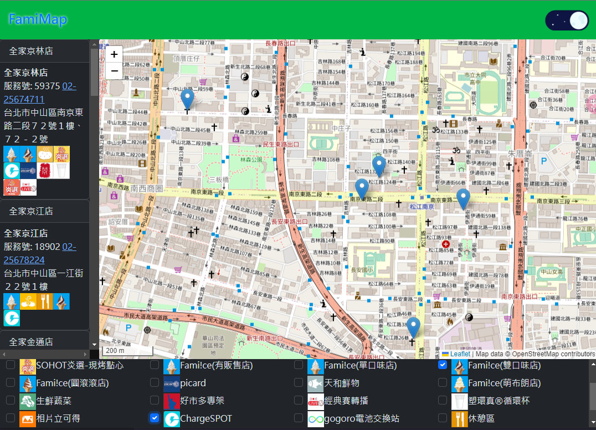
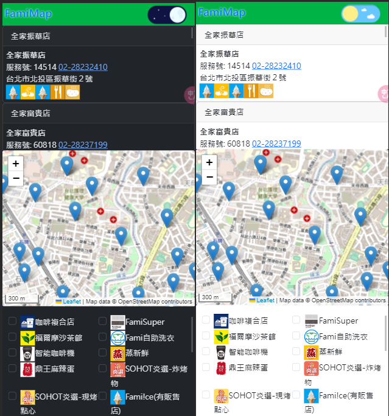

# famimap

[中文說明](README.zh-tw.md)
[DEMO](https://scott.is-a.dev/famimap)

This is a fullstack project for a map of FamilyMart stores in Taiwan. It's more intuitive than the [Official Map](https://www.family.com.tw/Marketing/storemap/). The project uses React.js and started with this template [express-es6-spa-example](https://github.com/scott1991/express-es6-spa-example).

## Tech Stack

- Node.js
- Express
- Mongoose
- MongoDB
- React.js
- Leaflet
- Bootstrap 5

## Features

- **Updates**: Uses `node-cron` to get store data from FamilyMart API and save it in MongoDB.
- **Map**: Shows stores with Leaflet and OpenStreetMap.Providing users with a more intuitive view.
- **Search**: Uses MongoDB's Geospatial Query `$near` to search for stores within a specified range.
- **Filter**: Lets users pick stores by services. (e.g., ice cream).
- **User Location Detection**:  Detects user's current location and move the map to there.
- **Themes**: Has Dark and Light themes for users to switch between.

## Installation

1. Clone this project and do `npm install`.
2. Rename `server/config.js.example` to `config.js` and fill it in (MongoDBURI).
3. Run with `node index.js`.
4. The program updates store info using `cronSchedule`. You may change the schedule.

## Requirements

- Node.js (version 12.20.0 or newer)
