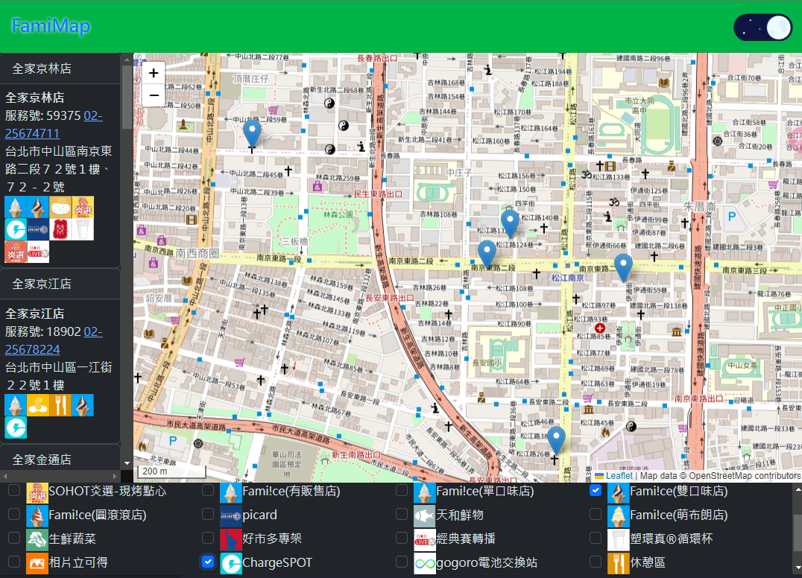
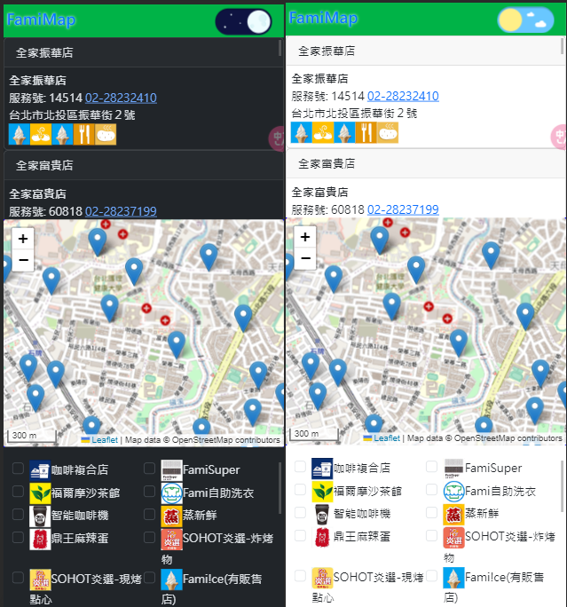

# famimap

[DEMO](https://scott.is-a.dev/famimap)

這個fullstack專案製做一個台灣全家便利商店的地圖，提供一個比 [官網地圖](https://www.family.com.tw/Marketing/storemap/) (https://www.family.com.tw/Marketing/storemap/) 更直觀的全家便利商店地圖介面，並使用 React.js 進行開發
該專案使用 [express-es6-spa-example](https://github.com/scott1991/express-es6-spa-example) 來初始化

## Tech Stack

- Node.js
- Express
- Mongoose
- MongoDB
- React.js
- Leaflet
- Bootstrap 5

## Features

- **定期更新**：使用 `node-cron` 定期從全家API抓取店家資料，並將其儲存到 MongoDB。
- **互動地圖**：透過 Leaflet 和 OpenStreetMap 來顯示店家位置，提供使用者更直觀的檢視方式。
- **地理空間查詢**：利用 MongoDB 的 Geospatial Query `$near` 功能，快速查詢指定範圍內的店家。
- **特定服務篩選**：允許使用者根據特定服務（例如：霜淇淋）來篩選店家。
- **使用者位置取得**：可以偵測使用者的當前位置，並且移動到該位置。
- **佈景主題切換**：提供 Dark 和 Light 兩種佈景主題，供使用者自由切換。

## Installation
1. clone此專案，安裝依賴 `npm install`
2. 將 `server/config.js.example`重新命名為`config.js` ，並完整其內容(MongoDBURI)
3. `node index.js` 啟動程式
4. 程式會以`cronSchedule`的排程更新店家資訊

## Requirements

- Node.js (建議版本 12.20.0+)
